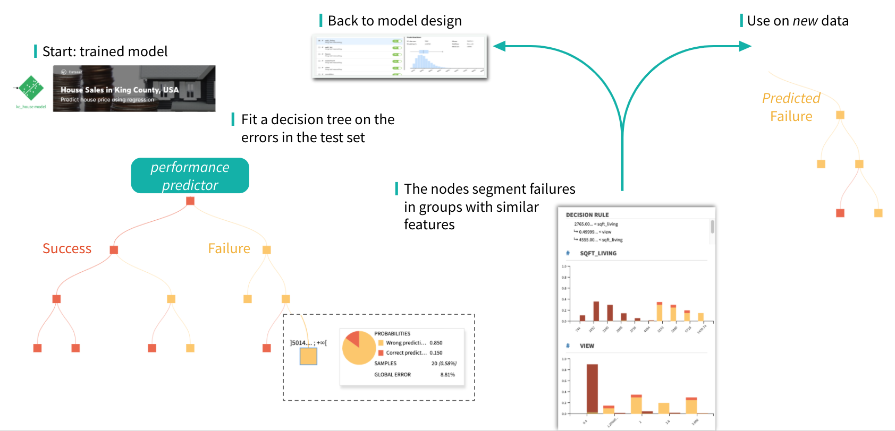

## Introduction

mea is a Python package to perform Model Error Analysis of scikit-learn models leveraging a Model Performance Predictor.

The project is currently maintained by [Dataiku's](https://www.dataiku.com/) research team.

## Getting started

MEA [documentation](https://dataiku.github.io/mea/) features some examples helping you getting started with Model Error Analysis:
* [Error Analysis on scikit-learn model](https://dataiku.github.io/mea/auto_examples/sklearn_structured.html) presents a basic error analysis on a regression model for structured data
* [Error Analysis on pipeline model](https://dataiku.github.io/mea/auto_examples/pipeline_structured.html) presents a basic error analysis on a pipeline regression model for structured data
* TODO: add examples from text data 

## Model Error Analysis

After training a ML model, data scientists need to investigate the model failures to build intuition on the critical sub-populations 
on which the model is performing poorly. This analysis is essential in the iterative process of model design and feature engineering 
and is usually performed manually. 

The mea package streamlines the analysis of the samples mostly contributing to model errors and provides the user with 
automatic tools to break down the model errors into meaningful groups, easier to analyze, and to highlight the most frequent 
type of errors, as well as the problematic features correlated with the failures.

We call the model under investigation the _primary_ model.

This approach relies on a Model Performance Predictor (MPP), a secondary model trained to predict whether the primary 
model prediction is correct or wrong, i.e. a success or a failure. More precisely, the MPP is a binary DecisionTree classifier 
predicting whether the primary model will yield a Correct Prediction or a Wrong Prediction. 

The MPP can be trained on any dataset meant to evaluate the primary model performances, thus containing ground truth labels. 
In particular the provided primary test set is split into a secondary training set to train the MPP and a secondary test set 
to compute the MPP metrics.

In classification tasks the model failure is a wrong predicted class, whereas in case of regression tasks the failure is 
defined as a large deviation of the predicted value from the true one. In the latter case, when the absolute difference 
between the predicted and the true value is higher than a threshold ε, the model outcome is considered as a Wrong Prediction. 
The threshold ε is computed as the knee point of the Regression Error Characteristic (REC) curve, ensuring the absolute error 
of primary predictions to be within tolerable limits. 

The leaves of the MPP decision tree break down the test dataset into smaller segments with similar features and similar 
model performances. Analyzing the sub-population in the error leaves, and comparing with the global population, provides 
insights about critical features correlated with the model failures.

The mea package leads the user to focus on what are the problematic features and what are the typical values of these features 
for the mis-predicted samples. This information can later be exploited to support the strategy selected by the user :
* improve model design: removing a problematic feature, removing samples likely to be mislabeled, ensemble with a model trained 
on a problematic subpopulation, ...
* enhance data collection: gather more data regarding the most erroneous under-represented populations,
* select critical samples for manual inspection thanks to the MPP and avoid primary predictions on them, generating model assertions. 

The typical workflow in the iterative model design supported by error analysis is illustrated in the figure below.



## Getting started with mea

Let `(X_train, y_train)` be the training data of the model to analyze, and `(X_test, y_test)` its test set.
The Model Error Analysis can be performed as:

```python
from mea.error_analyzer import ErrorAnalyzer
from mea.error_visualizer import ErrorVisualizer

# train any scikit-learn model
model = RandomForestClassifier()
model.fit(X_train, y_train)

# fit a Model Performance Predictor on the model performances
error_analyzer = ErrorAnalyzer(model, feature_names=feature_names)
error_analyzer.fit(X_test, y_test)

# print metrics regarding the Model Performance Predictor
print(error_analyzer.mpp_summary(X_test, y_test, output_dict=False))

# plot the Model Performance Predictor Decision Tree
error_visualizer = ErrorVisualizer(error_analyzer)
error_visualizer.plot_error_tree()

# print the details regarding the decision tree nodes containing the majority of errors
error_analyzer.error_node_summary(leaf_selector="all_errors", add_path_to_leaves=True, print_summary=True);
# plot the feature distributions of samples in the nodes containing the majority of errors
# rank features by correlation to error
error_visualizer.plot_feature_distributions_on_leaves(leaf_selector="all_errors", top_k_features=3)

```


## Using mea with pipeline to undo feature pre-processing

Let `(X_train, y_train)` be the training data of the model to analyze, and `(X_test, y_test)` its test set.
The numeric features `numerical_feature_names` are for instance pre-processed by a simple imputer and standard scaler, 
while the categorical `features categorical_feature_names` are one-hot encoded. 
The full pre-processing is provided to a `Pipeline` object in the form of a scikit-learn column transformer.
The last step of the pipeline is the model to analyze.

The Model Error Analysis can be performed as:

```python

from sklearn.preprocessing import StandardScaler, OneHotEncoder
from sklearn.compose import make_column_transformer
from sklearn.pipeline import make_pipeline
from sklearn.impute import SimpleImputer

from mea.error_analyzer import ErrorAnalyzer
from mea.error_visualizer import ErrorVisualizer

transformers = [
    (make_pipeline(SimpleImputer(), StandardScaler()), numerical_feature_names),
    (OneHotEncoder(handle_unknown='ignore'), categorical_feature_names)
]

preprocess = make_column_transformer(
    *transformers
)

pipeline_model = make_pipeline(
    preprocess,
    RandomForestClassifier())

# train a pipeline model

pipeline_model.fit(X_train, y_train)

# fit a Model Performance Predictor on the model performances
error_analyzer = ErrorAnalyzer(pipeline_model, feature_names=feature_names)
error_analyzer.fit(X_test, y_test)

# print metrics regarding the Model Performance Predictor
print(error_analyzer.mpp_summary(X_test, y_test, output_dict=False))

# plot the Model Performance Predictor Decision Tree
error_visualizer = ErrorVisualizer(error_analyzer)
error_visualizer.plot_error_tree()

# print the details regarding the decision tree nodes containing the majority of errors
error_analyzer.error_node_summary(leaf_selector="all_errors", add_path_to_leaves=True, print_summary=True);
# plot the feature distributions of samples in the nodes containing the majority of errors
# rank features by correlation to error
error_visualizer.plot_feature_distributions_on_leaves(leaf_selector="all_errors", top_k_features=3)

```

## Installation

### Dependencies

mea depends on:
- Python >= 3.5
- NumPy >= 1.11
- SciPy >= 0.19
- scikit-learn >= 0.19 
- matplotlib >= 2.0 
- graphviz >= 0.14
- pydotplus >= 2.0


### Installing with pip

The easiest way to install mea is to use `pip`. For a vanilla install, simply type:

    pip install -U mea


## Contributing

Contributions are welcome. Check out our [contributing guidelines](CONTRIBUTING.md).
